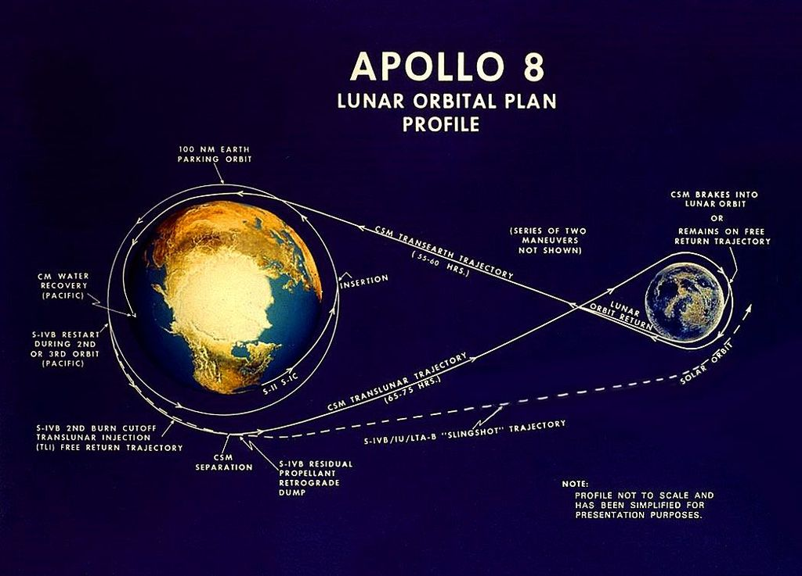

### Indholdsfortegnelse

* [Indledning](https://mpsteenstrup.github.io/Maanen-tur-retur/)
* [Former](https://mpsteenstrup.github.io/Maanen-tur-retur/former.html)
* [bevaegelse](https://mpsteenstrup.github.io/Maanen-tur-retur/bevaegslse.html)
* [Fysisk system](https://mpsteenstrup.github.io/Maanen-tur-retur/fysisk-system.html)
* [Jorden og satellit](https://mpsteenstrup.github.io/Maanen-tur-retur/jorden-og-satellit.html)
* [Jorden - månen, tur - retur](https://mpsteenstrup.github.io/Maanen-tur-retur/jorden-og-manen-tur-retur.html)
* [Kodestumper og opsamling](https://mpsteenstrup.github.io/Maanen-tur-retur/kodestumper-og-opsamling.html)

# Jorden og Månen

Vi har nu værktøjet til at simulere satellitter og derfor vores største satellit, Månen.

Nedenfor er en simulering med Jorden og Månen, ca. 400.000 km.

jorden-maanen-1

](billeder/jorden-maanen-1.png)
LINK: [https://glowscript.org/#/user/mps/folder/maanen/program/jord-maane-1](https://glowscript.org/#/user/mps/folder/maanen/program/jord-maane-1)

### Øvelser

* Kør simuleringen og prøv at lav I størrelsen af Jorden og Månen, så de kan ses. Vær opmærksom på at det ikke er den rigtige størrelse I så har.
* Passer omløbstiden med en måned?

### Øvelse
Men Månen har en omløbsid på 27 dage og 7 timer er Jordens på 24 timer. På grund af tidevandskrafterne hiver Jorden derfor Månen fremad. Vi kan undersøge hvilken effekt det har på Månen ved at lave lidt om i simuleringen.

* Ret linje 39 til ```sat.v=1.00000001*sat.v+F/mSat*dt```, så vi forøger hastigheden med 0.00001 promille.
* Ret tiden linje 34 så I får flere omløb og rate til noget højt, så I ikke keder jer.
* Hvilken effekt har det på månen?
* Undersøg hvad det betyder for den kinetiske og potentielle energi.

Bemærk at Månen mister kinetisk energi ved at blive trukket fremad. 

## Rejsen til Månen

Apollo 8 missionen sendte den 21. december 1968 tre astronauter en tur rundt om Månen.
Flyveplanen kan ses her.



Det er jeres opgave at eftergøre denne mission. I skal bruge hvad I har lært tidligere og lave om i koden.

](billeder/jorden-maanen-2.png)
LINK: [https://glowscript.org/#/user/mps/folder/maanen/program/jorden-maanen-2](https://glowscript.org/#/user/mps/folder/maanen/program/jorden-maanen-2)

### Overvejelser

Hvis I får brug for at lade kameraet følge satellitten så udkommenter linje 26.
* Prøv først at indstil affyringen fra orbit omkring Jorden, så i kommer hent til Månen. 
* Hvad er jeres hastighed når i kommer forbi Månen?
* Den er helt sikkert for høj, prøv at brems fartøjet.
* Prøv at se om I kan gå I orbit om Månen, det er ikke så let.
* Plot den kinetiske, potentielle og mekaniske energi og forklar hvad I ser.
* Det er svært at komme i kredsløb omkring månen, prøv evt. at forøg månens masse og se om det bliver lettere.
* Prøv at gøre simuleringen mere realistisk, indfør eks. bevægelse af månen, lad rumfartøjet accelerer over længere tid med en mindre acceleration, eller hvad I nu har lyst til.
